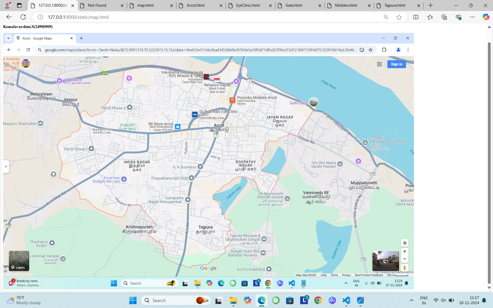
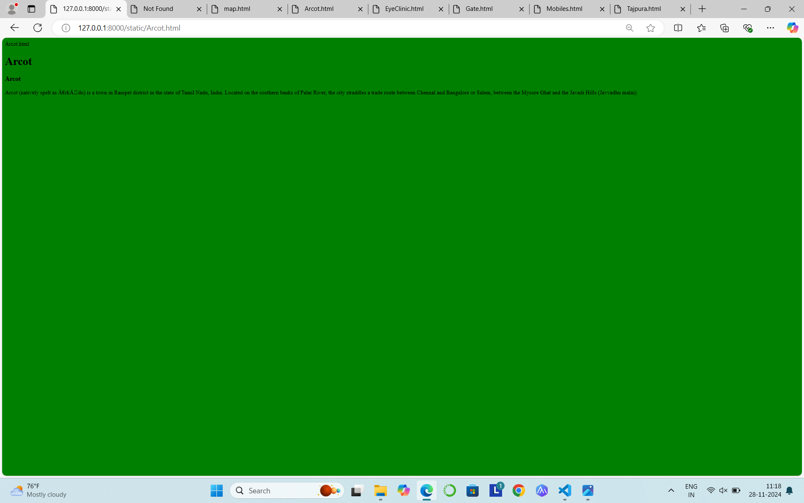
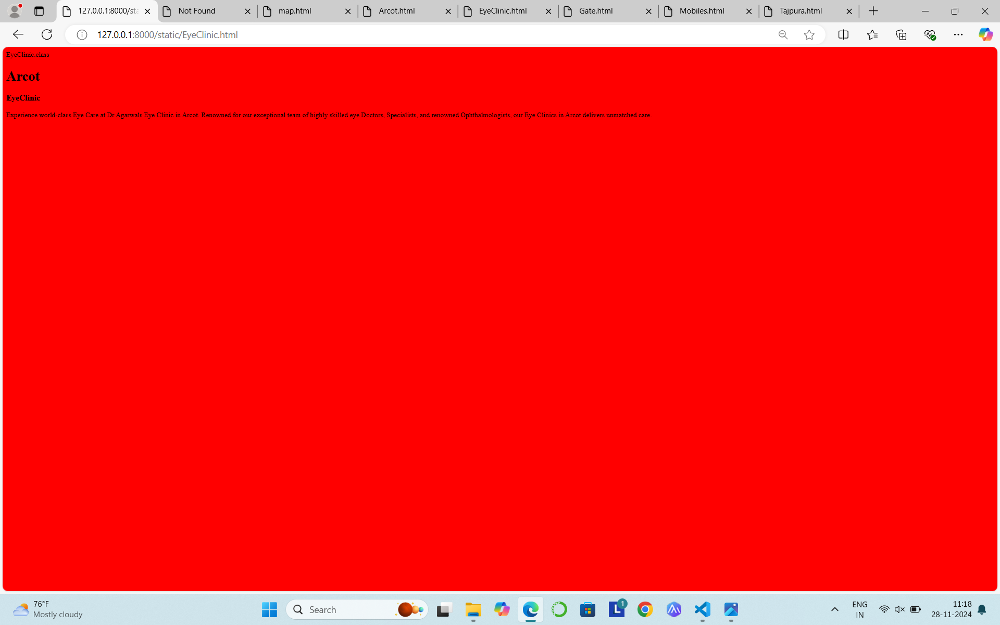
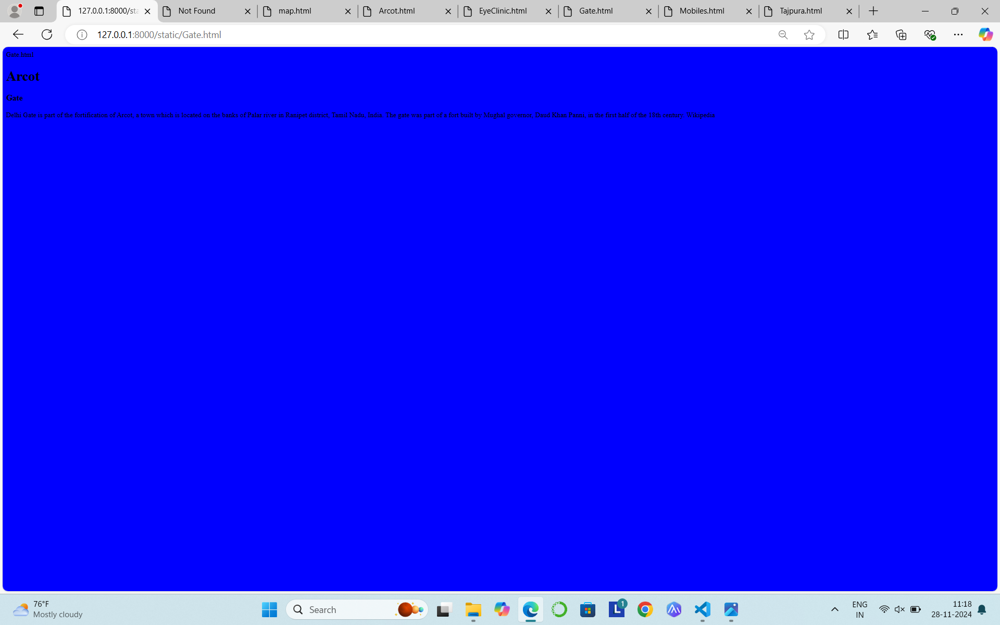
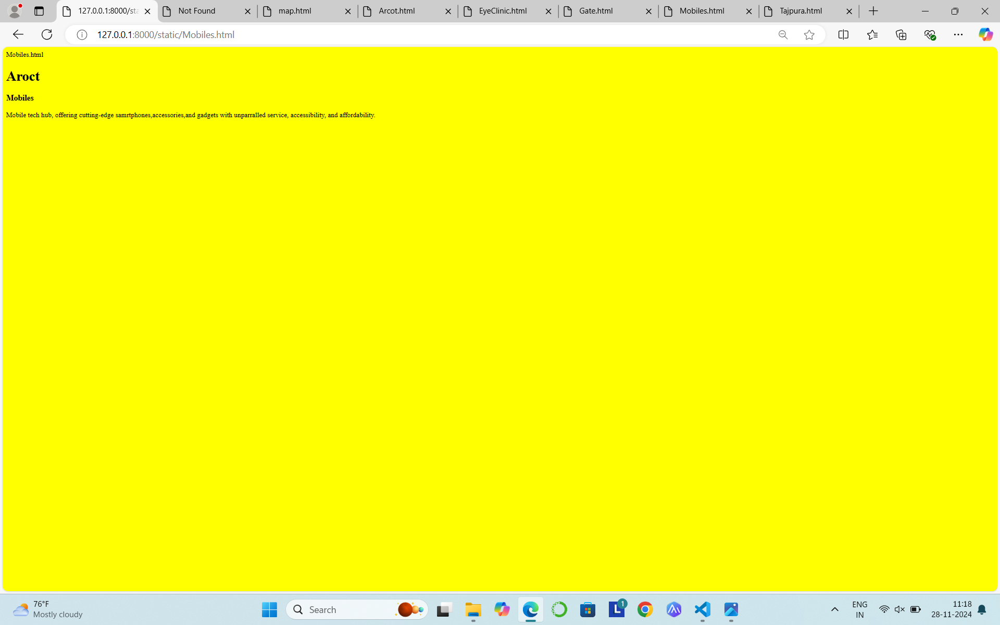
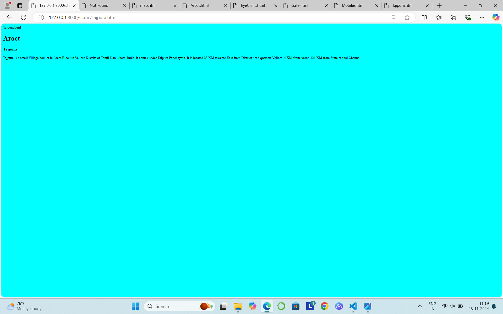

# Ex04 Places Around Me
## Date:28.11.2024

## AIM
To develop a website to display details about the places around my house.

## DESIGN STEPS

### STEP 1
Create a Django admin interface.

### STEP 2
Download your city map from Google.

### STEP 3
Using ```<map>``` tag name the map.

### STEP 4
Create clickable regions in the image using ```<area>``` tag.

### STEP 5
Write HTML programs for all the regions identified.

### STEP 6
Execute the programs and publish them.

## CODE
```
map.html
<html>
    <body>
        <h1>Arcot </h1>
        <h3>Komalavarshini.S(24900909) </h3>


<map name="image-map">
    <area target="" alt="Poorvika Mobiles" title="Poorvika Mobiles" href="Moblies" coords="1049,282,1294,345" shape="rect">
    <area target="" alt="Delhi Gate" title="Delhi Gate" href="Delhi Gate" coords="1409,321,76" shape="circle">
    <area target="" alt="Dr.Agarwals Eye Clinic" title="Dr.Agarwals Eye Clinic" href="Eye Clinic" coords="881,341,1105,363,1077,418,850,406,879,339" shape="poly">
    <area target="" alt="Arcot" title="Arcot" href="Arcot " coords="1009,455,47" shape="circle">
    <area target="" alt="Tajpura" title="Tajpura" href="Tajpura" coords="945,913,57" shape="circle">
</map>
  </body>
 </html>

 Arcot.html
<html>
    <body bgcolor="green">
        <h1>Arcot</h1>
        <h3>Arcot</h3>
        <p>
            Arcot (natively spelt as Ārkādu) is a town in Ranipet district in the state of Tamil Nadu, India. Located on the southern banks of Palar River, the city straddles a trade route between Chennal and Bangalore or Salem, between the Mysore Ghat and the Javadi Hills (Javvadhu malai).
        </p>
    </body>
</html>

EyeClinic.html
<html>
    <body bgcolor="red">
        <h1>Arcot</h1>
        <h3>EyeClinic</h3>
        <p>
            Experience world-class Eye Care at Dr Agarwals Eye Clinic in Arcot. Renowned for our exceptional team of highly skilled eye Doctors, Specialists, and renowned Ophthalmologists, our Eye Clinics in Arcot delivers unmatched care.
        </p>   
    </body>
</html>

Gate.html
<html>
    <body bgcolor="blue">
        <h1>Arcot</h1>
        <h3>Gate</h3>
        <p>
            Delhi Gate is part of the fortification of Arcot, a town which is located on the banks of Palar river in Ranipet district, Tamil Nadu, India. The gate was part of a fort built by Mughal governor, Daud Khan Panni, in the first half of the 18th century. Wikipedia
        </p>
    </body>
</html>

Mobiles.html
<html>
    <body bgcolor="yellow">
        <h1>Aroct</h1>
        <h3>Mobiles</h3>
        <p>
            Mobile tech hub, offering cutting-edge samrtphones,accessories,and gadgets with unparralled service, accessibility, and affordability.     
        </p>  
    </body>
</html>

Tajpura.html
<html>
    <body bgcolor="cyan">
        <h1>Aroct</h1>
        <h3>Tajpura</h3>
        <p>
            Tajpura is a small Village/hamlet in Arcot Block in Vellore District of Tamil Nadu State, India. It comes under Tajpura Panchayath. It is located 23 KM towards East from District head quarters Vellore. 4 KM from Arcot. 121 KM from State capital Chennai
        </p>
    </body>
</html>   

## OUTPUT






1.png



## RESULT
The program for implementing image maps using HTML is executed successfully.
